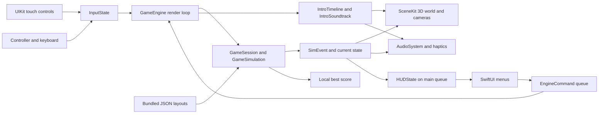

# Donkey Trump 3D — Current architecture

Updated: 2026-09-26. The filename is retained for existing references; this document records the implemented native iOS architecture and outstanding concerns. It supersedes the copied Phaser/static-web architecture options.

## System boundary and platform

The game is a local Swift application for iPhone on iOS 26+, running in landscape. The Xcode target also enables iPad. SceneKit renders the 3D world, SwiftUI presents menus/HUD, UIKit handles touch and haptics, GameController supplies controller/keyboard input, and AVFoundation plays bundled WAV audio.

The project is [DonkeyTrump3D.xcodeproj](../src/DonkeyTrump3D.xcodeproj/project.pbxproj), with the shared `DonkeyTrump3D` scheme and a Swift Testing target. Xcode 27 is the documented development baseline; the project uses Swift 5 language mode. The iOS app has no third-party package dependencies .

A separate [ASP.NET Core 10 Minimal API](../src/backend/README.md) implements global highscores using one private Block Blob. GET returns a complete uncached snapshot; POST applies validation/ranking with conditional ETag writes, bounded retries and no retry after an ambiguous write. Managed identity is the production credential route; emulator access is Development/Test-only. Client scores are not cheat-proof.

`GameSession` freezes one `CompletedRun` UUID/score/level on final-life Game Over. The render loop passes immutable HUD snapshots to `GameModel` on the main actor. `HighscoreCoordinator` owns observable presentation, a foreground URLSession service, an independent UI deadline, and generation/source/run guards. Start/restart never awaits networking. Cancellation/background/new runs retire publication; stale data is browse-only, refresh is GET-only and no payload queue exists. Highscores never enter the simulation loop. The exact returned POST snapshot positions by run ID; duplicate names cannot select another player.

All level data and audio ship in the app bundle. Models, textures and scene effects are largely generated by code. There is no browser shell, static hosting dependency, authentication, analytics adapter or remote configuration service.

## Architecture decisions

| Concern | Implemented choice | Consequence |
|---|---|---|
| Rendering | SceneKit scene graph and Metal-backed `SCNView` | Real 3D geometry, lighting, camera motion and particle effects |
| Gameplay simulation | Custom Swift systems on a fixed timestep | Arcade rules remain testable independently of rendering; SceneKit physics does not govern gameplay |
| Coordinates | Original 800 × 600 level space mapped onto a 3D plane | Authored level geometry and tuning can be reused while presentation gains depth |
| UI | SwiftUI overlays and observable `GameModel` | Native title, HUD, intro, pause, help and game-over controls |
| Input | UIKit multi-touch plus GameController | Touch is primary; controller and keyboard commands merge into the same `InputState` |
| Progression | Three authored layouts with an endless bounded difficulty ramp | Rescue advances play indefinitely; no terminal victory state |
| Intro | Pure `IntroTimeline` plus `IntroSoundtrack` | Motion, phase transitions and sound cues use the same cutscene clock |
| Audio | Pooled `AVAudioPlayer` voices; `.playback` and `.mixWithOthers` | Silent switch does not suppress enabled game audio; in-app mute still applies |
| Persistence | `UserDefaults` plus optional private Blob service | Local best/preferences stay independent; no saved active run or deferred upload |
| Delivery | Xcode build/sign/archive workflow | No committed CI pipeline or automatic production deployment exists |

## Components and source map

| Component | Source | Responsibility |
|---|---|---|
| App entry and model | [DonkeyTrump3DApp.swift](../src/DonkeyTrump3D/App/DonkeyTrump3DApp.swift) | SwiftUI lifecycle, observable UI model and SceneKit view bridge |
| Orchestration | [GameEngine.swift](../src/DonkeyTrump3D/App/GameEngine.swift) | Render delegate, fixed-step loop, commands, scene synchronisation, cameras, intro and feedback |
| Session and simulation | [Simulation.swift](../src/DonkeyTrump3D/Core/Simulation.swift) | Phases, hits, rescue, score/lives, retries and gameplay events |
| Rules and input contract | [Rules.swift](../src/DonkeyTrump3D/Core/Rules.swift) | `GamePhase`, scoring constants, timings, `InputState`, seeded random generator |
| Level data and progression | [Level.swift](../src/DonkeyTrump3D/Core/Level.swift) | Codable data, bundled layout loading and `DifficultyRamp` |
| Movement | [Player.swift](../src/DonkeyTrump3D/Core/Player.swift) | Jump/coyote time, jump cut, overlap-gated ladders and integration |
| Slopes and hazards | [Slope.swift](../src/DonkeyTrump3D/Core/Slope.swift), [Barrels.swift](../src/DonkeyTrump3D/Core/Barrels.swift) | Segment contacts, rolling, drops and direct throws |
| Intro choreography | [IntroTimeline.swift](../src/DonkeyTrump3D/Core/IntroTimeline.swift) | Geometry-derived path, carrying, signing, girder tilt and card phases |
| Intro sound cues | [IntroSoundtrack.swift](../src/DonkeyTrump3D/Core/IntroSoundtrack.swift) | Timestamped movement, signing, impact and ready cues |
| Automated play | [Autopilot.swift](../src/DonkeyTrump3D/Core/Autopilot.swift) | Title demonstration and deterministic gameplay tests |
| 3D world | [WorldBuilder.swift](../src/DonkeyTrump3D/Render/WorldBuilder.swift) | Tower, ladders, barrel geometry and environment |
| Rendering assets | [Materials.swift](../src/DonkeyTrump3D/Render/Materials.swift), [Characters.swift](../src/DonkeyTrump3D/Render/Characters.swift), [Effects.swift](../src/DonkeyTrump3D/Render/Effects.swift) | Coordinates, materials/textures, character rigs and particles |
| Input adapters | [Input.swift](../src/DonkeyTrump3D/Input/Input.swift) | Thread-safe touch snapshot, thumb stick/jump zones and input polling |
| Audio and haptics | [AudioSystem.swift](../src/DonkeyTrump3D/Audio/AudioSystem.swift) | WAV pools, music, mute preferences and UIKit feedback |
| UI and copy | [RootView.swift](../src/DonkeyTrump3D/UI/RootView.swift), [Copy.swift](../src/DonkeyTrump3D/UI/Copy.swift) | Menus, overlays and shared English copy; some labels remain inline |
| Resources | [Levels](../src/DonkeyTrump3D/Resources/Levels), [Audio](../src/DonkeyTrump3D/Resources/Audio) | Three JSON layouts and 20 WAV files |
| Verification | Swift/UITests and sibling backend.tests | Gameplay/audio regressions, Unicode contracts, failure lifecycle, CAS faults, concurrency and visible timing; see [validation](../specs/001-global-highscores/validation.md) |

## Runtime flow and threading

`DonkeyTrump3DApp` owns `GameModel`, which owns `GameEngine`. SwiftUI actions enqueue `EngineCommand` values. `GameSceneView` embeds an `SCNView`; SceneKit calls the engine's render delegate to drain commands, poll inputs, advance the session and synchronise visible nodes.

During gameplay, a time accumulator runs the core simulation in `1/120`-second steps. Frame delta is capped at `1/20` second. The intro advances from the render delta on its own timeline. The view requests 120 FPS, which is a preference rather than a hardware guarantee.

`InputHub`, the command queue and audio playback use locks for their shared state. HUD snapshots and haptic work are dispatched to the main queue. UI code should send commands instead of directly mutating the simulation or SceneKit nodes. Core gameplay types depend on Foundation, not SceneKit/SwiftUI.

## Gameplay plane, geometry and physics

The level format keeps the original 800 × 600 coordinate space, with positive Y downward. `WorldSpace` maps it to a 20 × 15 unit scene: `x = (levelX - 400) / 40`, `y = (600 - levelY) / 40`, with gameplay at `z = 0`. Geometry, scenery, lights and cameras occupy three-dimensional space around that plane.

Slopes are line segments. Player feet and barrel contacts are resolved explicitly; visual mesh collision is not used. Ladders use overlap zones and a climbing state. The default jump velocity of 210 and gravity of 500 produce an approximately 44.1-unit apex, below the authored floor gaps.

`GameSimulation` emits events for jumps, throws, landings, cleared barrels, hits and rescues. `GameSession` applies scoring/lives and transitions among `title`, `intro`, `play`, `paused`, `lifeLost`, `retrying`, `levelComplete` and `gameOver`. The renderer reacts to these events with poses, sound, haptics and particles.

Retries reset the current level while keeping score and remaining lives. Each attempt changes the random seed. Authored layouts repeat through `DifficultyRamp`, which overrides the legacy `rescue.isFinalLevel` flag to `false`.

## Level and asset contracts

`LevelLibrary` decodes `level1.json`, `level2.json` and `level3.json` using `JSONDecoder`. Codable fields cover dimensions, spawn points, girders, ladders, boss, barrels, rescue and difficulty. Extra legacy JSON fields such as sprite keys are not a dependency of native rendering.

The Xcode project uses filesystem-synchronised app/test groups, so Swift sources and resources under their target directories are discovered by Xcode. Audio is loaded by basename from the bundle; missing/undecodable audio is skipped. Missing or invalid level JSON currently calls `fatalError`. No friendly runtime asset-recovery screen or comprehensive schema validator is implemented; stronger content validation is an open backlog item.

All character/environment models are procedural. The audio library contains the 12 original synthesized web-game WAVs plus eight original native intro effects. [generate-intro-audio.py](../src/scripts/generate-intro-audio.py) regenerates only the new intro effects using Python's standard library. No external sound pack is required.

## Intro and audio lifecycle

`IntroTimeline` derives the carrying path from level ladders/girders, then schedules signing, top-to-bottom tilt and a level card. `IntroSoundtrack` converts the path and phase boundaries into sorted `IntroSoundCue` values. Each frame requests cues with an exclusive previous-time bound and inclusive current-time bound, so adjacent frames do not duplicate a cue and crossed boundaries are not lost.

The existing intro march loops during the path and stops on entry to signing. Eight dedicated sounds cover footsteps, climbing, putting Motzfeldt down, pen strokes, stamp, creak, impact and ready. Girder impact occurs at the end of each tilt, together with dust and haptic feedback. Stamp timing matches the on-screen signature reaching 80% of the signing phase.

`finishIntro()` and return-to-title stop every intro voice and discard the soundtrack. There are no delayed sound callbacks to fire after Skip. Reduce Motion starts at the level card, and `-introAt` establishes the requested starting time without replaying earlier cues.

`AudioSystem` uses `AVAudioSession` playback mode with mixing. The in-game mute flag is locked and persisted; setting it changes every active voice and music volume immediately. A muted intro loop keeps advancing at zero volume so later unmuting remains in time. Music tempo rises with level index and is capped at 1.6×.

There is no dedicated audio-interruption or route-change observer. Calls, headphones/Bluetooth changes, app suspension and subsequent audio recovery need physical-device validation. The lifecycle currently requests pause when leaving the active scene, but the engine accepts that command only during `.play`; a general pause model for intro and other transitions is not implemented.

## Persistence, privacy and failure boundaries

| Data | Storage and lifecycle |
|---|---|
| Current run, position, lives and level | Memory only; not restored after process termination |
| Best score | `UserDefaults` key `best`; persisted on rescue and game over |
| Sound preference | `UserDefaults` key `muted`; absent value defaults to sound enabled |
| Haptics preference | `UserDefaults` key `haptics`; absent value defaults to enabled |
| Layouts and WAVs | Read-only app-bundle resources |

No gameplay data is submitted to a service. There are no deployment tokens or runtime API credentials required by gameplay. Device signing and any future distribution credentials belong in Xcode/Keychain or the chosen build system, never source files or release notes.

Audio failure degrades to silent gameplay. Invalid required level content prevents startup. No general crash-recovery UI, remote diagnostics or production error-monitoring service exists. Best score storage is local convenience data, not an authoritative leaderboard.

## Build, distribution and verification

Build and test through Xcode or `xcodebuild` using the shared scheme. The deployment target is iOS 26.0; iPhone 13 simulators with iOS 26.5 and 27.0 and an iPhone 18 Pro with iOS 27.0 are available on the current development machine. Device UUIDs are machine-specific and should not be embedded in release automation.

The repository contains no GitHub Actions release workflow, Fastlane configuration, App Store export settings or automatic deployment on push. Creating an archive does not publish it. Signing, TestFlight/App Store configuration, retention of archives/dSYMs and release ownership remain release-preparation work. Follow the [iOS runbook](production-smoke-and-rollback.md).

The 18 existing tests cover level loading/connectivity, jump limits, difficulty bounds, slope contacts, movement, climbing, retries, an autopilot rescue, intro ordering, sound timing at different frame intervals, seek/Reduce Motion cue selection, bundled audio decoding and audio-session category/options. They do not verify physical silent-switch behaviour, human listening quality, hardware haptics, UI automation or frame-rate performance.

## Outstanding architectural concerns

| Concern | Current boundary | Follow-up |
|---|---|---|
| Device performance | HDR, shadows, particles, procedural textures and dynamic ladders can be expensive | Profile frame pacing, startup, memory and thermals on iPhone 13 |
| App/audio lifecycle | Gameplay pause exists; intro/interruption handling is limited | Test background/foreground, calls and audio routes; implement fixes based on findings |
| Accessibility | Some labels and Reduce Motion handling exist | Validate all menus, larger text, contrast and scene motion on-device |
| Content failures | Invalid required JSON terminates startup | Expand authored-level validation and decide a suitable recovery experience |
| Copy organisation | Main copy is in `Copy.swift`; several UI strings remain inline | Consolidate when extending copy or localising |
| iPad | Device family is enabled | Validate before claiming iPad release readiness |
| Release operations | Local build/test commands exist | Establish signed distribution and reproducible release records |

See the [product specification](prd_spec.md) for user-facing rules and the [backlog](backlog.md) for concrete acceptance checks.
