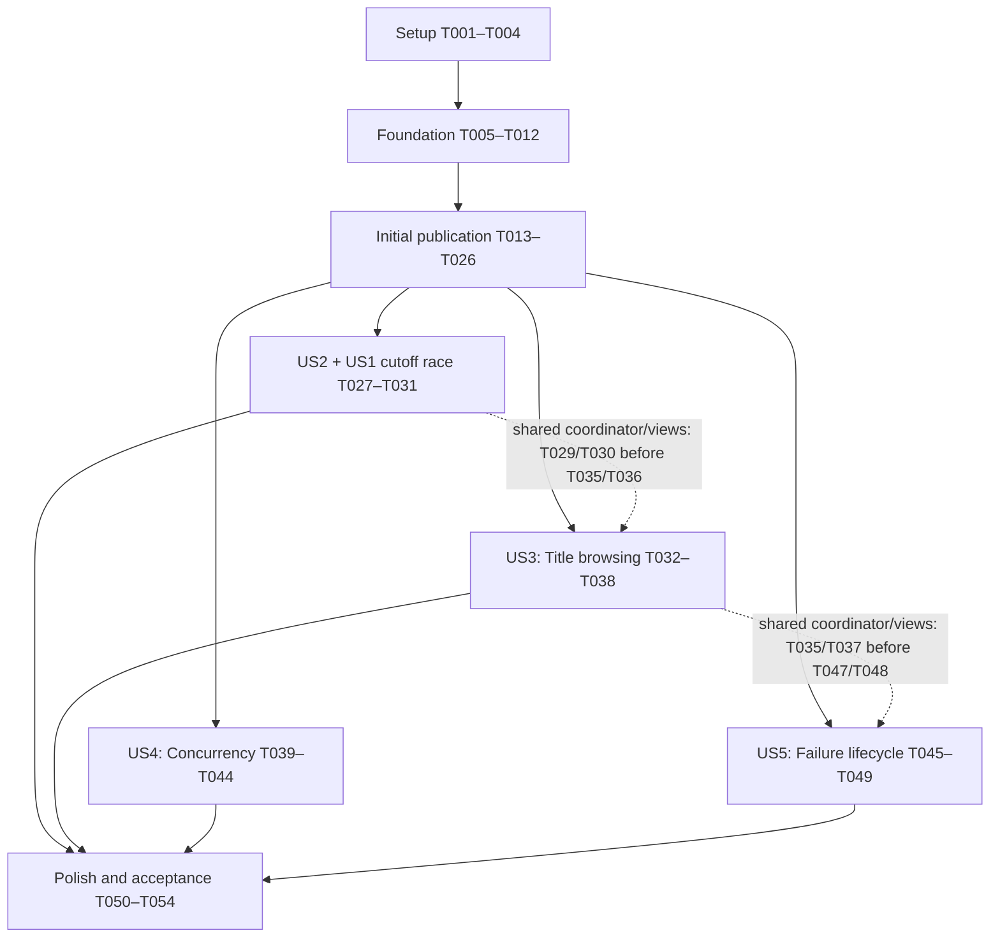

# Tasks: Global Top 100 Highscores

**Input**: [spec.md](spec.md), [plan.md](plan.md), [research.md](research.md), [data-model.md](data-model.md), [HTTP contract](contracts/highscores.openapi.yaml), [iOS flow](contracts/ios-flow.md) and [quickstart.md](quickstart.md).

**Governance**: [Constitution v1.0.0](../../.specify/memory/constitution.md), ratified 2026-09-26. The plan's gate has been reconciled to this version.

**Created**: 2026-09-26. **Status**: T001–T054 implemented and locally validated; see [validation.md](validation.md). Environment-specific release checks remain explicitly pending. Actual Git branch remains `main`; feature context is `001-global-highscores`.

**Tests**: Included because the specification explicitly defines each story's Independent Test, acceptance scenarios and SC-001–SC-006. Constitution principles III/V additionally require persistence/failure evidence. Use deterministic clocks/faults and outcome assertions; no blanket coverage target. Write the listed story tests before their implementation, observe the relevant failing assertions, and run them again at the story checkpoint.

**Organization**: Eight phases, with one phase per user story in specification order. All five stories are P1. T026 validates the initial publication slice, not complete US1 acceptance. The internal MVP also requires T031 for US1's cutoff-race scenario and US2. Full US1 acceptance additionally requires the two-installation check in T054; all P1 stories and applicable checks are required for feature completion.

## Format and paths

- Every actionable task is `- [ ] T### [P]? [US#]? Description with exact file path`.
- `[P]` marks a task eligible for a parallel wave **after** its stated prerequisites and phase entry gate finish. It never authorizes concurrent edits to the same file.
- Explicit task dependencies supplement the phase gates below; use the default sequential order when uncertain.
- Backend: `src/backend/`; sibling tests: `src/backend.tests/`. Keep one deployable API.
- iOS: `src/DonkeyTrump3D/`; Swift tests: `src/DonkeyTrump3DTests/`; new UI tests: `src/DonkeyTrump3DUITests/`.
- Shared test data: `src/tests/fixtures/`. New paths are intended deliverables, not claims that files already exist.
- Quoted field constraints are copied verbatim from the data model. Models used by multiple stories are in the foundation; networking never enters the gameplay core.
- Validation tasks update separate named sections of `specs/001-global-highscores/validation.md`; serialize those edits even when test suites run concurrently.

## Phase 1: Setup (Shared Infrastructure)

**Purpose**: Extend the existing projects and provide shared test inputs; do not scaffold a second API or replace the native app.

- [X] T001 Pin the researched Azure.Storage.Blobs/Azure.Identity packages in `src/backend/DonkeyTrump.Highscores.Api.csproj`; verify the current supported .NET 10 servicing baseline against official Microsoft/package sources, record the selected SDK and roll-forward policy in repository-root `global.json`, and reconcile versions in `specs/001-global-highscores/plan.md` and `specs/001-global-highscores/research.md`. Verify `dotnet --version` selects the intended SDK from the repository root and `src/backend`; T002 verifies the sibling test directory after creating it. Keep one Minimal API project and built-in framework facilities.
- [X] T002 [P] Create the sibling xUnit/WebApplicationFactory project `src/backend.tests/DonkeyTrump.Highscores.Api.Tests.csproj`, reference the existing API, pin compatible test packages, and expose the entry point from `src/backend/Program.cs` for integration tests; exclude test sources from the web project by directory placement. Verify `dotnet --version` from `src/backend.tests` follows the same repository-root SDK policy as the API and the documented root-level commands. (Depends on T001.)
- [X] T003 [P] Register `src/DonkeyTrump3DUITests/HighscoreUITestSupport.swift` and its XCUITest target in `src/DonkeyTrump3D.xcodeproj/project.pbxproj` and `src/DonkeyTrump3D.xcodeproj/xcshareddata/xcschemes/DonkeyTrump3D.xcscheme`; configure `HighscoreAPIBaseURL` through build/Info.plist settings with HTTPS for Release and a Debug-only localhost exception. Preserve synchronized source groups, iOS 26 minimum, landscape and existing tests; leave an unspecified production URL unavailable rather than inventing one. (FR-013, FR-019.)
- [X] T004 [P] Create reusable JSON examples in `src/tests/fixtures/highscores.json` for Swift/.NET consumption: NFC/decomposed Danish names, Løkke, emoji grapheme sequences, 20/21 graphemes, 256/257 UTF-8 bytes, Cc/Zl/Zp, invisible-only names, integer/UUID boundaries and valid/invalid snapshots. Include 0/99/100 rows, stable equal scores and duplicate names with distinct IDs; provide expected canonical values/errors. (FR-001, FR-002, FR-007, FR-016.)

**Checkpoint**: Both existing projects still build; the sibling backend test project and shared iPhone UI-test scheme are discoverable.

## Phase 2: Foundational (Blocking Prerequisites)

**Purpose**: Establish the shared records, validation boundaries, injectable interfaces and deterministic test support. Complete this phase before any user story.

**Entry gate**: T001–T004 complete. This phase blocks every story.

- [X] T005 [P] Define request/canonical values in `src/backend/Highscores/HighscoreSubmission.cs` and deterministic validation in `src/backend/Highscores/HighscoreValidation.cs`. Quote-enforced field rules: submissionId "Non-zero UUID; canonicalize to lowercase hyphenated form"; score "0–2,147,483,600 inclusive; multiple of 100"; levelReached "1–2,147,483,647 inclusive". Require all four fields and JSON numbers, reject unknown fields and missing integers. For displayName: "reject control characters (Unicode category Cc) and line/paragraph separators (Zl/Zp) anywhere, normalize to NFC, trim surrounding Unicode space separators (Zs), then require 1–20 extended grapheme clusters and at most 256 encoded UTF-8 bytes." Also "Reject empty names and names containing only whitespace/formatting marks." Preserve internal spaces, punctuation, case and printable emoji; compare normalized name/score/level for same-ID equality. (Depends on T004; FR-007, FR-016.)
- [X] T006 Define and validate the private document in `src/backend/Highscores/HighscoreDocument.cs`: schemaVersion "Exactly 1; unknown versions fail closed"; nextSequence (positive int64) "Next assignable tie sequence; starts at 1 and exceeds every stored sequence"; entries "0–100, sorted by score descending then sequence ascending". StoredEntry rules: submissionId "Unique within the document"; displayName "Canonical validated name"; score "Validated score"; levelReached "Validated level, private supporting data"; sequence (positive int64) "Unique server-assigned successful-save order"; acceptedAtUtc "Server clock; informational, not used to break ties". Bound full UTF-8 content to 256 KiB and reject duplicate sequences, invalid/unsorted rows and overflow without repair. Keep accounts, device IDs, IPs and receipt archives out of the document. (Depends on T005; FR-001, FR-002, FR-003, FR-009.)
- [X] T007 Define response DTOs in `src/backend/Highscores/HighscoreContracts.cs` and a narrow injectable read/submit boundary in `src/backend/Highscores/IHighscoreStore.cs`. Public field rules: entries[] "Public rows `{ entryId, rank, displayName, score }`; no private sequence or level"; entryId "Same UUID as the stored run; UI identity and highlight target"; rank "Contiguous index starting at 1, derived per snapshot"; revision "Opaque ETag text for an existing document, or `empty` before first creation; not an integer or freshness guarantee"; fetchedAtUtc "Server UTC timestamp when the snapshot was observed/constructed"; outcome "POST only: `ranked` or `notQualified`"; POST root entryId/rank "Present only for `ranked`, matching one row in the returned snapshot". Use UTC RFC 3339 milliseconds, a full 100-row snapshot for notQualified, and the exact Problem Details status/code/error-field contract in `specs/001-global-highscores/contracts/highscores.openapi.yaml`. (Depends on T005, T006; FR-001, FR-002, FR-009, FR-010.)
- [X] T008 [P] Add immutable Codable/Sendable request/snapshot/problem DTOs and an injectable async protocol in `src/DonkeyTrump3D/Highscores/HighscoreModels.swift` and `src/DonkeyTrump3D/Highscores/HighscoreService.swift`. Apply the same quoted field constraints as T005/T007, explicitly decode fractional-second UTC dates, ignore additive response fields, and reject more than 100 rows, duplicate IDs, non-contiguous ranks, increasing scores, invalid names/scores and inconsistent ranked root ID/rank. Keep name normalization advisory and consistent with shared fixtures; invalid responses never establish qualification. (Depends on T004; FR-005, FR-007, FR-010, FR-016, FR-018.)
- [X] T009 [P] Bind and validate `Highscores:*` configuration in `src/backend/Highscores/HighscoreOptions.cs` and wire it in `src/backend/Program.cs`: private container/blob names, production HTTPS BlobServiceUri and reused ManagedIdentityCredential/Blob client, optional managed identity client ID, Development/Test-only Azurite, six-second operation and two-second network budgets, SDK MaxRetries=0, five CAS writes, and configurable GET 40/20-per-second and POST 10/2-per-second token buckets with zero queue. Reject invalid startup configuration; do not create production containers or require Blob connectivity for `/health/live`. (FR-003, FR-013, FR-014, FR-016.)
- [X] T010 Define the immutable Equatable/Sendable shared run value in `src/DonkeyTrump3D/Core/CompletedRun.swift`: id "Fresh non-zero random ID for every new game and restart"; score "Final run score, not personal best"; levelReached "One-based final level". Define presentation states and an injectable deadline clock in `src/DonkeyTrump3D/Highscores/HighscoreState.swift`. State rules: closed "No presentation; start/restart/title always allowed"; loading "Source `title` or `completedRun(id)`, generation, deadline; controls remain active"; browsing "Snapshot plus top/bottom/highlight anchor, optional stale marker and final score"; enteringName "Immutable run and a fresh qualification observation; submit or cancel"; submitting "One canonical payload in memory, generation/deadline; repeated taps disabled"; failed "Readable error; optional stale browse-only snapshot; completed run's submission opportunity retired". Define the terminal run outcomes "published, notQualified, cancelled or failed"; only a confirmed editable-name validation rejection is non-terminal. Keep all payload/draft/cache state in memory. (Depends on T008; FR-005, FR-006, FR-014, FR-015, FR-017, FR-018.)
- [X] T011 Create `src/backend.tests/Support/HighscoreApiFactory.cs`, `src/backend.tests/Support/BlobFaultTransport.cs` and `src/backend.tests/Support/AzuriteFixture.cs` with injectable time/jitter, deterministic read/write barriers, commit-then-lose-ack faults and per-scope emulator containers. Use Azurite 3.37.0 without a Docker requirement; opt into StorageIntegration via HighscoresTests__UseAzurite=true, fail when explicitly requested but unavailable, share one container across two API instances for concurrency, and clean only containers owned by that fixture. (Depends on T002, T007, T009; FR-009, FR-017, SC-003, SC-006.)
- [X] T012 [P] Create injectable clock/service/URLProtocol spies in `src/DonkeyTrump3DTests/HighscoreTestSupport.swift` and Debug-only app fixtures in `src/DonkeyTrump3D/Highscores/HighscoreFixtures.swift`. Implement rank-1, rank-50, rank-100, below-cutoff, equal-cutoff, empty, duplicate-names, cutoff-race, validation-error, unavailable, hang, slow-stream, late-response and save-ack-lost; include request counts and completed-run launch inputs for UI tests, with app/engine injection wired in T025. Ordinary deterministic fixtures use injected services. Add a separate explicit Debug integration mode for T050/T054 using a test-run-owned loopback API backed by isolated Azurite storage; reject other origins and redirects leaving the selected origin, with no production-URL fallback. Gate all launch overrides/fixtures out of Release and prevent autopilot/demo/test modes from publishing to production. (Depends on T003, T008, T010; FR-010, FR-013, FR-015, FR-017, SC-002, SC-005.)

**Checkpoint**: The common types and fixtures compile independently of SceneKit/network availability; configuration errors are explicit and fixture modes cannot reach production.

## Phase 3: User Story 1 — Publish a qualifying result (Priority: P1) — Initial slice

**Goal**: Capture a genuine final-life result, qualify with a fresh read, explicitly publish a public name, and show the returned exact entry centred.

**Independent Test**: With a prepared 0/99/100-row list, complete a run, submit and confirm the same entry through a second independent API client. Test ranks 1/50/100, cancellation, name correction, canonical same-ID replay and changed-payload rejection. Storage CAS and finite failure handling are included in this first slice, not deferred to US4.

**Acceptance boundary**: The test above covers the initial slice. US1 scenario 6 (qualification lost during name entry) is implemented and verified by T027–T031. The specification's second-app-installation acceptance is verified by T054. Neither is waived or represented as passing at T026.

**Entry gate**: T005–T012 complete.

### Tests

- [X] T013 [P] [US1] Write HTTP contract tests in `src/backend.tests/HighscoreEndpointTests.cs` and ranking/validation cases in `src/backend.tests/HighscoreRankingTests.cs`: GET empty/populated; POST required fields, numeric boundaries, shared names, identical canonical replay/current rank, changed payload 409, unknown fields, 400/413/415 and bounded chunked bodies. Assert complete ranked/notQualified snapshots, public-only fields, UTC milliseconds, Cache-Control:no-store and dependency-free `/health/live`; prepare cases before implementing the routes/ranker. (FR-001, FR-002, FR-005, FR-007, FR-009, FR-016.)
- [X] T014 [P] [US1] Write run lifecycle tests in `src/DonkeyTrump3DTests/CompletedRunTests.swift`: fresh identity on start and restart, one immutable final score/level only after the last life, persistent completion through repeated HUD observations, and no completion for rescue, ordinary life loss, abandoned run or title/demo. Assert local best is independent of publication and publication uses this run's score. (FR-004, FR-017.)
- [X] T015 [P] [US1] Write qualification/publication and transport tests in `src/DonkeyTrump3DTests/HighscorePublicationTests.swift` and `src/DonkeyTrump3DTests/HighscoreServiceTests.swift`: fresh 0/99/100-row eligibility, historical personal best greater than the final-run score, canonical name correction only after confirmed validation failure, one POST while pending, cancel, exact returned ID/snapshot, malformed response/unknown save outcome and immediate deadline expiry despite cancellation-ignoring transport. (FR-004, FR-005, FR-006, FR-007, FR-009, FR-015, FR-017.)
- [X] T016 [P] [US1] Write rank/name-flow UI cases in `src/DonkeyTrump3DUITests/HighscorePublicationUITests.swift` using Debug fixtures: explicit public-name consent, invalid name feedback, cancel without POST, keyboard dismissal and the exact UUID fully visible at ranks 1/50/100 (interior centred), including repeated names/equal scores. Establish failing feature assertions before wiring the screens. (FR-006, FR-007, FR-008, FR-010, FR-019, SC-002.)

### Implementation and validation

- [X] T017 [P] [US1] Capture and clear the immutable CompletedRun defined by T010 in `src/DonkeyTrump3D/Core/Simulation.swift` on new game/restart/title/final-life transitions; carry active run identity and persistent optional completion in `src/DonkeyTrump3D/App/GameEngine.swift` HUD snapshots/equality and main-queue publication. Generate a fresh non-zero run ID at both starts, freeze final score/one-based level only after the last life, and retain completion throughout Game Over. Include no networking/name data in core/render code and preserve existing intro/scoring/local-best rules. (Depends on T014; FR-004, FR-015, FR-017.)
- [X] T018 [P] [US1] Implement pure canonical deduplication and candidate ranking in `src/backend/Highscores/HighscoreRanking.cs`: accept valid zero when fewer than 100 entries; when full require score strictly greater than the last score; sort descending score/ascending successful-save sequence and truncate to 100. Preserve sequence on same-ID replay, reject changed canonical payload, increment nextSequence only in the candidate committed with its entry, and fail safely on overflow. Preserve non-unique names and document deduplication limited to currently stored IDs. (Depends on T013; FR-001, FR-002, FR-005, FR-009, FR-016.)
- [X] T019 [US1] Implement `src/backend/Highscores/BlobHighscoreStore.cs` with bounded content+ETag from one read, virtual empty only on BlobNotFound in an existing container, and one small conditional Put Blob (If-Match or first-create If-None-Match:*). Reread/recompute only recognized ConditionNotMet/first-create BlobAlreadyExists conflicts, at most five total writes with 25–100 ms jitter inside one linked six-second budget including credential/read/backoff/write. On success return the exact candidate plus write ETag without a follow-up GET; on any ambiguous attempted write return submission_unconfirmed with no further write. Never reset corrupt/missing-container state, stage blocks or fall back to an unconditional write. (Depends on T018; FR-003, FR-009, FR-014, FR-017.)
- [X] T020 [US1] Map GET/POST `/api/v1/highscores` in `src/backend/Highscores/HighscoreEndpoints.cs` and `src/backend/Program.cs` to the store, cancellation and validators. Enforce "Require all four fields, valid JSON object, JSON numbers rather than numeric strings, and `application/json`."; "Reject unknown fields, including client-supplied rank/sequence/timestamp."; "Bound the received body to 4,096 bytes, including chunked input, before materializing it." Return 200 ranked/notQualified, the OpenAPI Problem Details mappings, no-store snapshots and safe errors; activate configured process-wide GET/POST buckets with integer Retry-After on 429, zero queue and no authentication/account flow. (Depends on T019; FR-001, FR-003, FR-009, FR-014, FR-016.)
- [X] T021 [P] [US1] Implement `src/DonkeyTrump3D/Highscores/URLSessionHighscoreService.swift` and `src/DonkeyTrump3D/Highscores/HighscoreConfiguration.swift`: foreground ephemeral session, waitsForConnectivity=false, request/resource timeout at most eight seconds, strict response invariants, HTTPS Release base URL, no custom TLS bypass, no automatic resend/background session. Missing/invalid configuration returns optional-feature unavailable; distinguish pre-write errors from potentially committed POSTs, including malformed/lost acknowledgements, using the contract's error codes. (Depends on T015; FR-013, FR-014, FR-017, FR-018.)
- [X] T022 [US1] Implement the main-actor qualification/publish flow in `src/DonkeyTrump3D/Highscores/HighscoreCoordinator.swift`: fresh GET after one completion, immutable run/source/generation guards, finite independent eight-second clock that updates UI without awaiting cancellation, public-name submit/cancel and disabled repeated taps. Retire cancelled/failed/published/notQualified runs, permit explicit correction only for confirmed name-only validation errors, reject score/run errors terminally, and never use stale cache or persist a draft/queue. Provide synchronous invalidation for start/restart/title/background and observed engine transitions; expose notQualified for US2 presentation. (Depends on T017, T021; FR-005, FR-006, FR-009, FR-014, FR-015, FR-017, FR-018.)
- [X] T023 [P] [US1] Add `src/DonkeyTrump3D/UI/HighscoreNameEntryView.swift` and update `src/DonkeyTrump3D/UI/Copy.swift` with an English single-line name form, literal text, inline validation, Submit/Cancel, and explicit notice that the chosen name and score will be public without requiring a real name. Update in-app privacy/help copy to distinguish optional public scores from device-local best/settings, preserve parody/no-affiliation wording, and dismiss the keyboard before result presentation. (Depends on T022, T016; FR-006, FR-007, FR-008, FR-020.)
- [X] T024 [P] [US1] Add `src/DonkeyTrump3D/UI/HighscoreListView.swift` for public rank/name/score rows keyed by entry UUID; use the successful POST snapshot without a replacing GET, highlight only its exact entry, and scroll after layout/keyboard dismissal to centre with boundary clamping and the full row visible. Support top/bottom anchors for subsequent stories; do not interpret player names as markup. (Depends on T022, T016; FR-001, FR-010, SC-002.)
- [X] T025 [US1] Integrate the injected main-actor coordinator with `src/DonkeyTrump3D/App/DonkeyTrump3DApp.swift` and Game Over in `src/DonkeyTrump3D/UI/RootView.swift`. Route normal buttons through synchronous invalidation before engine commands; observe HUD run/phase changes for controller-driven restart/title paths. Preserve thread-safe snapshot handoff, keep Play Again/Return to Title reachable throughout loading/form/list states, and block production publication by demo/autopilot/test fixtures. Only T012's explicit Debug integration mode may send automated requests to its test-run-owned loopback API/Azurite fixture. Verify origin restrictions, redirect rejection, no production fallback and Release exclusion; ordinary fixtures continue to use injected services. (Depends on T023, T024; FR-004, FR-005, FR-008, FR-010, FR-013, FR-015.)
- [X] T026 [US1] Run the initial publication slice's backend contract/ranking tests, an Azurite save/read/replay with a second independent client, Swift core/coordinator/transport tests and rank/name XCUITests on iPhone 13. Record commands, versions, outcomes and gaps in `specs/001-global-highscores/validation.md`; confirm zero-score partial-list publication, ranks 1/50/100, consent, no duplicate save and no gameplay gate before marking only this initial slice complete. US1's cutoff-race acceptance remains pending until T031 and its second-app-installation acceptance until T054. (Depends on T020, T025; FR-001, FR-004, FR-006, FR-007, FR-008, FR-009, FR-010, SC-002.)

**Checkpoint**: The initial publication slice passes. This is neither complete US1 acceptance nor the internal MVP; T031 and T054 retain the outstanding acceptance checks above.

## Phase 4: User Story 2 — See the next target after missing the list (Priority: P1)

**Goal**: Show the bottom and the completed run's final score when it misses the cutoff, including qualification lost while entering a name.

**Independent Test**: Run below/equal-cutoff and cutoff-race fixtures against a full list. No name prompt appears for fresh non-qualification; rank 100 and final score remain visible and Play Again/Return to Title work immediately.

**Entry gate**: Initial publication slice T026 complete (not full US1 acceptance). Default UI integration dependencies additionally preserve earlier changes to shared coordinator/views; US4 can proceed alongside the later iOS work.

### Tests

- [X] T027 [P] [US2] Write fresh-cutoff and displacement transition cases in `src/DonkeyTrump3DTests/HighscoreNonqualificationTests.swift`: below/equal full cutoff, partial-list zero still qualifies, server notQualified after name entry and successful entry displaced on later explicit refresh. Assert no mistaken success, new name prompt or same-name highlight. (Depends on T026; FR-005, FR-009, FR-011, FR-018.)
- [X] T028 [P] [US2] Write below-cutoff/equal-cutoff/cutoff-race UI cases in `src/DonkeyTrump3DUITests/HighscoreNonqualificationUITests.swift`; assert the last real row, unchanged final score, no name prompt for non-qualification and immediate Play Again/Return to Title, including a cutoff change between GET and POST. (Depends on T026; FR-011, FR-013, SC-002.)

### Implementation and validation

- [X] T029 [US2] Complete notQualified/displaced-entry transitions in `src/DonkeyTrump3D/Highscores/HighscoreCoordinator.swift`: select the actual last row, retain the immutable run score, retire publication and distinguish server cutoff changes from success. Define the explicit-refresh displacement transition now for the US3 read action; stale or invalid reads cannot establish non-qualification. (Depends on T027; FR-009, FR-011, FR-018.)
- [X] T030 [US2] Wire bottom positioning, final-score context, changed-cutoff explanation and reachable replay/title actions in `src/DonkeyTrump3D/UI/HighscoreListView.swift`, `src/DonkeyTrump3D/UI/RootView.swift` and `src/DonkeyTrump3D/UI/Copy.swift`. Clamp to the last real rank without inventing empty rows; do not hide navigation inside the scrolling list. (Depends on T028, T029; FR-011, FR-013, FR-019.)
- [X] T031 [US2] Run the US2 coordinator/UI fixtures and US1 scenario 6 and capture cutoff, final-score and immediate-navigation evidence in `specs/001-global-highscores/validation.md`; verify both equality and a qualifying GET followed by a non-qualifying POST that shows the updated bottom with an explanation and no success claim. This completes the internal MVP with T026, without requiring title browsing or live Azure; full US1 acceptance still needs T054's second-app-installation check. (Depends on T030; FR-009, FR-011, SC-002.)

**Checkpoint**: The story's independent test passes; record any remaining release-environment gap without claiming it was tested.

## Phase 5: User Story 3 — Browse from the title without delaying play (Priority: P1)

**Goal**: Expose a closable title-screen ranking with fresh/error/stale states, accessible navigation and a deadline independent of network progress.

**Independent Test**: Open from title with normal/empty/slow/hung services, start during loading, and deliver an old response during a new run. Verify top positioning, error by eight seconds, explicit read-only retry, visibly stale cache and landscape accessibility.

**Entry gate**: Initial publication slice T026 complete (not full US1 acceptance). Default UI integration dependencies additionally preserve earlier changes to shared coordinator/views; US4 can proceed alongside the later iOS work.

### Tests

- [X] T032 [P] [US3] Extend the GET contract evidence in `src/backend.tests/HighscoreReadContractTests.cs`: empty versus populated snapshot, no-store/no-304 behavior, BlobNotFound versus missing container/corrupt data/unavailable storage, bounded cancellation and stable public projection. Ensure a failed read cannot look like an empty valid ranking. (Depends on T026; FR-012, FR-014, FR-018.)
- [X] T033 [P] [US3] Write browsing/deadline/generation cases in `src/DonkeyTrump3DTests/HighscoreBrowsingTests.swift`: top anchor, a selected entry disappearing on an explicit refresh (explain displacement and show the last real row), eight-second hang/slow-stream/uncooperative-task timeout, close/start/controller restart versus late response, explicit retry and stale browse-only cache; assert refresh never reopens a terminal run's qualification and an absent/invalid URL does not block play. (Depends on T026; FR-012, FR-013, FR-014, FR-015, FR-018.)
- [X] T034 [P] [US3] Write title/landscape UI cases in `src/DonkeyTrump3DUITests/HighscoreBrowsingUITests.swift`: open/close while loading, immediate Start, empty/error/stale text, read-only refresh, rank/name/score accessibility labels and reachable navigation at standard/large accessibility sizes with the software keyboard dismissed. (Depends on T026; FR-012, FR-013, FR-014, FR-019.)

### Implementation and validation

- [X] T035 [US3] Implement title browsing and explicit read-only refresh in `src/DonkeyTrump3D/Highscores/HighscoreCoordinator.swift`, reusing generation guards/deadline rather than gating Start. Open at top; keep cache in session memory only, show "Previously loaded — may be out of date." on refresh failure, distinguish fresh empty from errors, and apply the displacement/bottom transition without requalifying failed runs. (Depends on T029, T033; FR-012, FR-013, FR-014, FR-015, FR-018.)
- [X] T036 [US3] Add the title Highscores action and closable loading/empty/error/browse presentation in `src/DonkeyTrump3D/UI/RootView.swift`, `src/DonkeyTrump3D/UI/HighscoreListView.swift` and `src/DonkeyTrump3D/UI/Copy.swift`. Keep Start/help/sound/haptics usable while a fetch is pending or failed, provide explicit list Retry, and ensure closing cannot let a delayed response reopen the presentation. (Depends on T030, T034, T035; FR-012, FR-013, FR-014, FR-015, FR-018.)
- [X] T037 [US3] Complete adaptive iPhone landscape layout in `src/DonkeyTrump3D/UI/HighscoreListView.swift` and `src/DonkeyTrump3D/UI/HighscoreNameEntryView.swift`: scalable semantic row text, safe-area/keyboard accommodation, rank/name/score/Your result VoiceOver labels and one-time focus on the selected row. Keep close/replay/title controls reachable at large text sizes and preserve Reduce Motion, sound and haptics preferences. (Depends on T036; FR-010, FR-019, SC-002.)
- [X] T038 [US3] Run GET contract, browsing/deadline and title/landscape UI tests and record real iPhone 13 simulator configuration and results in `specs/001-global-highscores/validation.md`. Prove late callbacks cannot interrupt a newer run and a continuously streaming/hung request leaves loading by eight seconds; explicitly retain physical VoiceOver/keyboard checks as release evidence pending a real device. (Depends on T032, T037; FR-013, FR-014, FR-015, FR-018, FR-019, SC-004.)

**Checkpoint**: The story's independent test passes; record any remaining release-environment gap without claiming it was tested.

## Phase 6: User Story 4 — Preserve the ranking during simultaneous submissions (Priority: P1)

**Goal**: Prove the shared CAS ranking across instances, validate operational limits and package the same small service for hosting.

**Independent Test**: Run deterministic two-writer/first-create races and 100 concurrent submissions against one Azurite container, including equal scores, duplicates and fault injection; restart the API and compare two independent clients' identical stored snapshot/version.

**Entry gate**: Initial publication slice T026 complete (not full US1 acceptance). Default UI integration dependencies additionally preserve earlier changes to shared coordinator/views; US4 can proceed alongside the later iOS work.

### Tests

- [X] T039 [P] [US4] Add deterministic storage fault tests in `src/backend.tests/BlobHighscoreStoreTests.cs`: same-read ETag, If-Match/If-None-Match, reread/recompute on recognized conflicts only, exactly bounded attempts/backoff/deadline, committed-write lost acknowledgement with no second upload, and no post-save reread. Cover unknown schema, corrupt/oversized/chunked content, duplicate IDs/sequences, unsorted entries, missing container, auth failure and sequence overflow; assert no overwrite or empty replacement. (Depends on T026; FR-003, FR-009, FR-014, FR-017.)
- [X] T040 [P] [US4] Add opt-in two-instance Azurite integration tests in `src/backend.tests/HighscoreConcurrencyTests.cs`: deterministic first-create/update races where both valid writers succeed, equal-score save order, currently ranked same-ID replay, restart persistence and a 100-concurrent-write oracle seeded with existing entries. Raise rate limits only in this correctness fixture; compare the final top 100 with all successfully considered results and confirmed committed-but-unacknowledged writes, record explicit failures, and forbid a vacuous pass by rejecting every writer. (Depends on T026; FR-001, FR-002, FR-003, FR-009, FR-016, SC-003, SC-006.)
- [X] T041 [P] [US4] Add production-boundary tests in `src/backend.tests/HighscoreBoundaryTests.cs`: real configured GET/POST token buckets and zero queue, 429 integer Retry-After, strict known-length/chunked 4,096-byte limits, Problem Details without stack traces, production HTTPS/managed-identity configuration versus dev-only emulator mode, and liveness during Blob outage. Capture diagnostics and assert they exclude player names, full score payloads, secrets and client IPs. (Depends on T026; FR-009, FR-014, FR-016.)

### Implementation and validation

- [X] T042 [US4] Add scoped route/outcome/duration/CAS-attempt/error-class diagnostics in `src/backend/Highscores/HighscoreDiagnostics.cs` and integrate them through `src/backend/Highscores/BlobHighscoreStore.cs` and `src/backend/Program.cs`. Use no raw body/name/score-payload/IP/credential logging; preserve the bounded CAS and ambiguous-write behavior proven by T039 and the endpoint limits proven by T041. Document that throttling is per replica, not globally coordinated abuse prevention. (Depends on T039, T041; FR-009, FR-014, FR-016, FR-017.)
- [X] T043 [P] [US4] Package the API in `src/backend/Dockerfile` and `src/backend/.dockerignore` using the selected serviced .NET 10 SDK/runtime, with the build image's SDK verified against repository-root `global.json`, a non-root runtime user, explicit port and minimal publish output; exclude local settings, credentials and emulator/test data. Keep `/health/live` storage-independent and prepare container verification for T044 on a Docker-capable runner without making Docker a prerequisite for Azurite development. (Depends on T026; FR-003.)
- [X] T044 [US4] Execute storage fault, two-instance concurrency/restart and boundary suites; confirm real progress, exact final ranking, stable ties and persistence after process restart with no intervening writes. Record versions, acknowledged/unconfirmed/rejected outcome counts, final revision comparison and container build/run evidence or an explicit unavailable-tool limitation in `specs/001-global-highscores/validation.md`; do not claim managed-identity/Azure validation from emulator results. (Depends on T040, T042, T043; FR-001, FR-002, FR-003, FR-009, FR-016, SC-003, SC-006.)

**Checkpoint**: The story's independent test passes; record any remaining release-environment gap without claiming it was tested.

## Phase 7: User Story 5 — Keep playing when publication fails (Priority: P1)

**Goal**: Complete and verify offline/lost-acknowledgement lifecycle behavior with local best preserved and no later score submission.

**Independent Test**: Interrupt before qualification, before write and after write/before acknowledgement. Reconnect, explicitly refresh and relaunch; local best remains, no failed run gets a new prompt/POST, and an ambiguous save is described as unconfirmed.

**Entry gate**: Initial publication slice T026 complete (not full US1 acceptance). Default UI integration dependencies additionally preserve earlier changes to shared coordinator/views; US4 can proceed alongside the later iOS work.

### Tests

- [X] T045 [P] [US5] Add failure matrix tests in `src/DonkeyTrump3DTests/HighscoreFailureTests.swift`: failed qualification, before-write failure, committed/lost/malformed acknowledgement, timeout, 409/429/5xx, score/run versus editable-name validation, cancel/background/return/new-run races, reconnect and read-only refresh. Use spies/fake time to assert local best preservation, terminal opportunity retirement and no second/deferred POST even when transport ignores cancellation. (Depends on T026; FR-006, FR-014, FR-015, FR-017, FR-018, SC-005.)
- [X] T046 [P] [US5] Add end-to-end Debug-fixture cases in `src/DonkeyTrump3DUITests/HighscoreFailureUITests.swift` for offline Game Over, save-ack-lost, background/foreground, reconnect/refresh and relaunch. Verify the persisted personal best, active retry/title controls, accurate error text and zero deferred POSTs after reopening; allow only explicit read retry and ensure fixture request accounting survives long enough to detect unintended replay. (Depends on T026; FR-013, FR-015, FR-017, SC-005.)

### Implementation and validation

- [X] T047 [US5] Wire scene lifecycle in `src/DonkeyTrump3D/App/DonkeyTrump3DApp.swift` and complete retirement handling in `src/DonkeyTrump3D/Highscores/HighscoreCoordinator.swift`: backgrounding cancels and invalidates immediately, foregrounding never resumes publication, retired completed-run HUD snapshots cannot re-prompt, and reconnect/read refresh cannot resend. Ensure cancellation never claims to undo a committed write and existing UserDefaults best/settings remain independent. (Depends on T035, T045; FR-014, FR-015, FR-017, FR-018.)
- [X] T048 [US5] Complete failure presentation in `src/DonkeyTrump3D/UI/RootView.swift` and `src/DonkeyTrump3D/UI/Copy.swift`: unknown attempted saves say "We couldn't confirm whether your score was saved."; known pre-save/unavailable cases explain that the local personal best is retained. Never assert qualifying/notQualified from a failed read, expose no publication Retry, and keep Play Again/Return to Title immediately usable. (Depends on T037, T046, T047; FR-011, FR-013, FR-014, FR-017, FR-020.)
- [X] T049 [US5] Execute failure/reconnect/relaunch UI and coordinator tests plus existing `src/DonkeyTrump3DTests/CoreTests.swift` and `src/DonkeyTrump3DTests/IntroAudioTests.swift`; record no-resend request counts, preserved best and regression outcomes in `specs/001-global-highscores/validation.md`. Keep silent-switch/physical audio claims separate from simulator evidence. (Depends on T048; FR-013, FR-015, FR-017, SC-005.)

**Checkpoint**: The story's independent test passes; record any remaining release-environment gap without claiming it was tested.

## Phase 8: Polish & Cross-Cutting Concerns

**Purpose**: Measure acceptance targets, update actual-behavior documentation and leave explicit release prerequisites.

**Entry gate**: Increment checkpoints T026, T031, T038, T044 and T049 complete; final cross-installation acceptance remains in T054.

- [X] T050 Add and run `src/DonkeyTrump3DUITests/HighscorePerformanceTests.swift`: measure 100 starts/restarts across normal/delayed/unavailable services against a same-device baseline with every added latency <100 ms; use T012/T025's explicit Debug integration mode against a warmed test-run-owned loopback API with isolated Azurite to measure 100 list/confirmed-submit visibility samples at <=100 ms RTT with p95 <=2 seconds. Include hung/slow-stream attempts leaving loading within eight seconds and correlate readiness with actual visible UI, not just HTTP completion; record the integration target/isolation settings and raw timing/baseline/device configuration in `specs/001-global-highscores/validation.md`. (Depends on T031, T038, T044, T049; SC-001, SC-004.)
- [X] T051 [P] Add a reproducible k6 load driver in `src/backend.tests/Performance/highscores-load.js` for a warm 10 GET/s + 1 POST/s five-minute run and a separate ten-submission burst, with valid distinct run IDs, <=100 ms test RTT, latency percentiles and explicit 429/error counts. Keep the 100-writer correctness test separate and test-only elevated limits out of production; document invocation, tooling version and safe local/emulator target in `src/backend/README.md`. (Depends on T044; SC-003, SC-004.)
- [X] T052 Update actual implementation/configuration/privacy behavior in `README.md`, `src/backend/README.md`, `docs/prd_spec.md`, `docs/architecture_options.md` and `docs/backlog.md`: native 3D iPhone top-100 entry points, optional public names, client-reported scores, scoped deduplication, concurrency/failure rules, async gameplay independence and no deferred upload. Reconcile design contracts in `specs/001-global-highscores/contracts/highscores.openapi.yaml` and `specs/001-global-highscores/contracts/ios-flow.md` only to validated behavior; unresolved requirement differences need an explicit decision rather than silently weakening the spec. (Depends on T050, T051; FR-001, FR-002, FR-012, FR-013, FR-016, FR-017, FR-020.)
- [X] T053 Reconcile runnable commands in `specs/001-global-highscores/quickstart.md` and release/recovery steps in `docs/production-smoke-and-rollback.md`: pinned Azurite/local test setup, same-region private Hot/LRS Blob and Container Apps Consumption 0–2 replicas, HTTPS ingress, container-scoped managed-identity RBAC, credential handling, modest log retention/cost alert and warm-versus-cold behavior. Record required real subscription/region/hostname and physical iPhone 13 VoiceOver/Dynamic Type/keyboard/audio checks as release inputs/checks, with no invented values, resource provisioning, destructive score reset or release-readiness claim. (Depends on T052; FR-003, FR-013, FR-017, FR-019, FR-020.)
- [X] T054 Run the documented backend build/unit/contract/Azurite/concurrency/load and iPhone 13 Swift/UI/performance checks, validate Release URL/ATS/fixture exclusion and OpenAPI examples, compare the same ranking/revision from two isolated app installations using T012/T025's explicit Debug integration mode against the same test-run-owned loopback API/Azurite after a service restart, and inspect changed diagnostics/configuration for data leakage. Complete US1's second-installation acceptance as well as SC-006 before finalizing dated requirement-to-evidence results in `specs/001-global-highscores/validation.md` with commands, simulator/device/runtime versions and pass/fail/pending status; recheck constitution v1.0.0. Physical-device, container and live Azure managed-identity checks require their actual environments and remain pending when unavailable; this task does not provision/deploy Azure or publish the app. (Depends on T053; FR-001, FR-002, FR-003, FR-004, FR-005, FR-006, FR-007, FR-008, FR-009, FR-010, FR-011, FR-012, FR-013, FR-014, FR-015, FR-016, FR-017, FR-018, FR-019, FR-020, SC-001, SC-002, SC-003, SC-004, SC-005, SC-006.)

**Checkpoint**: Local implementation evidence covers FR-001–FR-020 and SC-001–SC-006; unperformed physical-device, container or Azure checks remain explicitly pending, without a deployment claim.

## Dependencies & Execution Order

### Phase and story graph

- **Setup**: T001 selects backend versions before T002 references them. T003 and T004 touch different files and can proceed independently.
- **Foundation**: T005 → T006 → T007 creates canonical/private/public backend boundaries; T008 → T010 creates the client/run/state types; T009 configures the service; T011/T012 provide separate test harnesses. All finish before US1.
- **US1**: T013–T016 are independent test files. Backend T018 → T019 → T020 and client T017/T021 → T022 can proceed separately. T023/T024 produce separate views; T025 joins app/UI ownership. T026 validates only the initial publication slice; T031 covers US1 scenario 6 and T054 covers its two-installation acceptance.
- **US2, US3, US5**: Fixtures make each story independently testable without completing real gameplay or relying on another screen. They reuse US1. The default integration order is US2 → US3 → US5 because they edit the same coordinator/views; their independent test files can be authored in parallel after T026.
- **US4**: Depends on the initial publication storage/API slice, not on later UI stories. It can run alongside US2/US3/US5. The concurrency algorithm and no-ambiguous-retry behavior already exist in T019; US4 adds exhaustive proof, observability and packaging.
- **Polish**: After the increment checkpoints, run T050/T051 independently, then T052 → T053 → T054. T050 touches validation evidence; T051 touches the load driver/backend guide.
- Do not overlap edits to `Program.cs`, `HighscoreCoordinator.swift`, `RootView.swift`, `HighscoreListView.swift`, `Copy.swift` or the validation record. No actor/thread, storage or failure guarantee may be postponed merely to make a demonstration pass.

### Parallel execution examples

These are scheduling examples, not instructions to start agents or invoke implementation during task generation.

| Story | Prerequisite | Safe parallel work | Join point |
|---|---|---|---|
| US1 | Foundation complete | T013 backend contracts, T014 run lifecycle, T015 coordinator/transport and T016 UI tests use separate files | T017/T018/T021 implement against those cases |
| US1 | T022 and T016 complete | T023 name form/copy and T024 ranking view | T025 integrates both |
| US2 | T026 complete | T027 coordinator cutoff cases and T028 UI cutoff cases | T029/T030 implement the flow |
| US3 | T026 complete | T032 GET contracts, T033 browsing/deadline tests and T034 title UI tests | T035/T036, respecting prior shared-file tasks |
| US4 | T026 complete | T039 storage faults, T040 two-instance integration and T041 boundary tests | T042 then T044; T043 packaging has distinct files |
| US5 | T026 complete | T045 failure-state unit tests and T046 lifecycle UI tests | T047/T048, after shared UI dependencies |

## Requirement Coverage

The following mapping names the implementing tasks and specific evidence. T054 audits the recorded evidence and completes the two-installation integration check; it does not replace the focused story tests.

| Requirement | Implementation / validation tasks |
|---|---|
| FR-001 | T006, T007, T018, T020 / T013, T026, T040, T044 |
| FR-002 | T006, T007, T018 / T013, T040, T044 |
| FR-003 | T006, T009, T019, T043 / T039, T040, T044, T053 |
| FR-004 | T010, T017, T025 / T014, T015, T026 |
| FR-005 | T008, T018, T022 / T013, T015, T027 |
| FR-006 | T010, T022, T023 / T015, T016, T045 |
| FR-007 | T005, T008, T023 / T004, T013, T015, T016 |
| FR-008 | T023, T025 / T016, T026 |
| FR-009 | T006, T018, T019, T020, T022, T029 / T013, T027, T039, T040, T044 |
| FR-010 | T007, T024, T037 / T016, T026, T038 |
| FR-011 | T029, T030, T048 / T027, T028, T031 |
| FR-012 | T035, T036 / T032, T033, T034, T038 |
| FR-013 | T021, T025, T030, T035, T036, T048 / T028, T034, T046, T050 |
| FR-014 | T009, T019, T020, T021, T022, T035, T036 / T033, T038, T039, T041, T050 |
| FR-015 | T017, T022, T025, T035, T047 / T033, T034, T038, T045, T046 |
| FR-016 | T005, T018, T020, T042 / T013, T040, T041, T044 |
| FR-017 | T010, T017, T019, T021, T022, T047, T048 / T039, T045, T046, T049 |
| FR-018 | T008, T022, T029, T035 / T027, T032, T033, T038, T045 |
| FR-019 | T003, T037 / T016, T034, T038, T053 |
| FR-020 | T023, T048, T052, T053 / T016, T054 |
| SC-001 | T050 (100 starts/restarts; <100 ms additional latency) |
| SC-002 | T016, T026, T028, T031, T037 (ranks 1/50/100, bottom, visibility) |
| SC-003 | T039, T040, T044 (100 concurrent results, stable ties, non-vacuous success) |
| SC-004 | T033, T038, T050, T051, T054 (eight-second deadline; warm p95 <=2 seconds) |
| SC-005 | T045, T046, T049 (three interruption points, reconnect/relaunch, no replay) |
| SC-006 | T040, T044, T054 (restart persistence, independent clients and two app installations) |

### Data-model ownership

| Entity / constraint group | Concrete tasks |
|---|---|
| CompletedRun identity, score, final level, lifecycle | T010 declarations; T014 tests; T017 capture/HUD; T025 consumption |
| Canonical Submission and normalized public name | T004 shared fixtures; T005 authoritative validation; T008 client DTOs; T013/T015 tests; T020 bounded HTTP body |
| LeaderboardDocument and StoredEntry | T006 invariants; T018 pure ranking; T019 conditional persistence; T039/T040 fault/concurrency evidence |
| Public snapshot and POST outcome | T007 DTOs; T008 decoder invariants; T013/T032 contracts; T020 routes; T024/T029/T035 presentation |
| Local ranking states and terminal run outcomes | T010 declarations; T022 lifecycle; T029/T035 presentation transitions; T047 scene retirement; T045/T046 no-replay proof |

## Implementation Strategy

### MVP first

1. Complete Setup and Foundation (T001–T012).
2. Complete the initial publication slice (T013–T026) with real conditional storage, immutable run identity, bounded waits, explicit public-name consent and no deferred upload. This alone does not complete US1 or the MVP.
3. Complete T027–T031, including US1 scenario 6 and the below-cutoff flow. Demonstrate both a centred published result and qualification lost during name entry with the updated bottom and no success claim. **T001–T031 is the suggested internal MVP**, not release approval or complete US1 acceptance.
4. Complete US3–US5 and all cross-cutting checks, including T054's second-app-installation acceptance for US1/SC-006, before claiming the requested feature complete. All stories are P1; US4 correctness and US5 failure guarantees are not optional release work.

### Incremental delivery and verification

Use the increment checkpoints to validate each change without needing all later screens. Run the listed focused tests as implementation changes, then the full relevant checks in T054; broaden/repeat only for changed behavior or unresolved failures. Preserve existing audio/intro/gameplay and local best regressions. The increment checks are independently reproducible using prepared storage or injected services; full US1 acceptance explicitly joins T026, T031 and T054.

No login, historical receipt archive, moderation system, offline queue, backend provisioning or App Store distribution is introduced by this task list. Real Azure managed identity/permissions, container runtime, physical accessibility/audio and selected release configuration must be verified in their actual environments before release. Record unperformed checks as pending with the concrete missing input; emulator/simulator success is not a substitute.

## Task Summary

| Group | Tasks |
|---|---:|
| Setup | 4 |
| Foundation | 8 |
| US1 — qualifying publication | 14 |
| US2 — below-cutoff target | 5 |
| US3 — title browsing | 7 |
| US4 — simultaneous submissions | 6 |
| US5 — failed publication | 5 |
| Polish / acceptance | 5 |
| **Total** | **54** |

All 54 implementation tasks are checked against the dated validation record. Independent review/consensus is recorded separately before the completion report. No deployment is implied.
